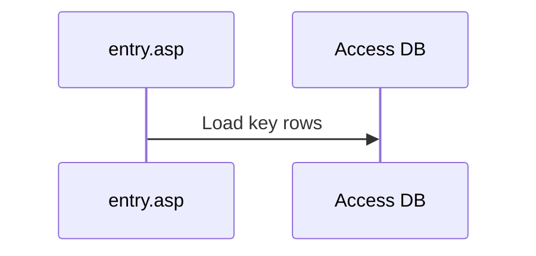

# E500 Documentation Skill

## Core Style

Write documentation as reusable engineering knowledge, not chat transcript.

- Prefer Obsidian Markdown: YAML frontmatter, `[[wikilinks]]`, callouts, Mermaid diagrams when useful, and short table-driven sections.
- Keep the tone direct, compact, and factual.
- Explain system relationships: tables, Classic ASP files, entry points, runtime flow, admin flow, and participant state.
- Preserve decisions and boundaries: what to use, what not to reuse, why the distinction matters.
- Make docs useful for future implementation, Jira comments, review notes, and onboarding.
- Avoid broad prose. Use `Fast Facts`, `Data Model`, `Runtime Flow`, `Admin Flow`, `Boundary`, `Schema`, `Risks`, and `Related` sections.

## File Placement

For E500 repo knowledge, write or update files under `.agent/docs`.

- Use one note per durable concept, content type, subsystem, or table group.
- Update `.agent/docs/00-docs-index.md` when adding a new note.
- Link related notes with Obsidian wikilinks.
- Put implementation plans under `.agent/plans`, not `.agent/docs`.
- Put running implementation decisions/logs under `.agent/logs`.

## Note Template

Use this shape unless the existing document already has a stronger local pattern:

```markdown
---
type: investigation
topic: Short Topic Name
status: active
tags:
  - e500
  - classic-asp
  - obsidian
---

# Short Topic Name

> [!summary]
> One compact statement of what this thing is and why it matters.

## Fast Facts

| Fact | Value |
|---|---|
| Admin entry | `path/file.asp` |
| Learner entry | `path/file.asp` |
| Main table | `table_name` |

## Data Model

| Table | Role | Key fields |
|---|---|---|
| `table_name` | Purpose. | `id`, `field_id` |

## Runtime Flow



## Boundary

> [!important]
> Decision or rule future work must preserve.

## Related

- [[other-note]]
```

## Content Rules

When documenting E500, capture these details if they are known:

- Exact Classic ASP files and their role.
- Exact table names and key fields.
- Content type constants and `opdracht_item_types` ids.
- Admin entry, learner entry, and save/answer endpoints.
- State ownership: definition table, participant table, answer table, result/progress table.
- Schema changes required before code can work.
- Runtime side effects, especially progress, scoring, LT navigation, and copy/delete behavior.
- Non-obvious choices made during implementation.

## Diagrams

Use Mermaid when it reduces cognitive load:

- `flowchart` for table relationships or implementation dependency.
- `sequenceDiagram` for request/runtime flow.
- Keep node labels short and literal.
- Prefer real table/file names over abstract labels.

## Jira Comments

When creating a Jira-ready comment:

- Start with what was attempted or implemented.
- Use bullets for changed areas.
- Include required schema separately.
- Include PR link when known.
- Avoid excess narrative and speculation.
- Mark open risks or follow-up clearly.

## E500 Boundaries To Preserve

- Do not conflate `Vragenlijst` and `Toets`: Toets wraps a source VL but owns scoring/result state.
- Do not reuse a table just because the names look similar. Document the actual owner and usage.
- Treat Classic ASP learner pages, admin pages, and schema rows as a connected contract.
- Be explicit about whether progress completes on open, on answer, or on save.
- Prefer documenting verified usage from `rg`/file reads over assumptions.
